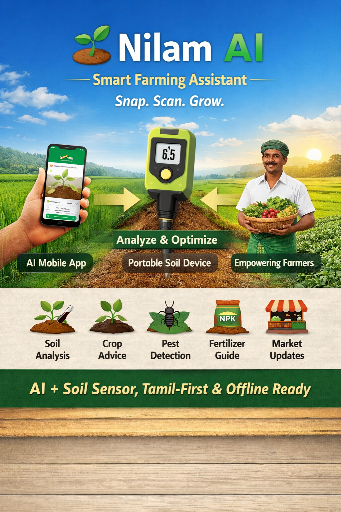

# 🌱 Nilam AI – Smart Farming Assistant

**Snap. Scan. Grow.**

Nilam AI is an AI-powered smart farming platform that helps farmers make better decisions using real-time insights. It combines a mobile application with a low-cost soil testing device to improve crop yield, reduce input costs, and increase farmer income.

---

## 📸 Project Preview

---

## 🚀 Features

* 📸 **Soil & Crop Scanning** – Analyze soil and crops using AI
* 🌱 **Crop Recommendation** – Suggest suitable crops based on soil conditions
* 🐛 **Pest & Disease Detection** – Identify issues instantly
* 🧪 **Fertilizer Guidance** – Optimize input usage
* 🏪 **Nearby Shop Integration** – Connect to seed & fertilizer suppliers
* 📈 **Market Insights** – Real-time crop price updates

---

## 💡 Innovation

* AI-powered soil detection using image processing
* Portable low-cost soil testing device (hardware integration)
* All-in-one farming platform (soil → crop → pest → market)
* Tamil-first interface for rural accessibility
* Offline support for low-connectivity regions
* Scalable to IoT-based smart agriculture

---

## 🌍 Impact

* Increase farmer productivity and income
* Reduce unnecessary fertilizer usage
* Enable data-driven farming decisions
* Promote sustainable agriculture

---

## 📊 Market Opportunity

* 🇮🇳 140+ Million farmers in India
* 🌾 ~8 Million farmers in Tamil Nadu
* 📈 Rapidly growing AgriTech market
* 📱 Increasing smartphone penetration in rural areas

---

## 🎯 Target Users

* Small & marginal farmers
* Progressive smartphone farmers
* Agri retailers (seeds, fertilizers)
* Government & agri organizations

---

## 💰 Funding Requirement

₹10–25 Lakhs for:

* App development
* AI model development
* Field testing
* Marketing & outreach

---

## 🛠️ Tech Stack (Planned)

* Frontend: HTML / Mobile App
* Backend: Node.js / Firebase
* AI/ML: Python (TensorFlow / OpenCV)
* Hardware: ESP32 / Soil Sensors

---

## 📌 Project Status

🚧 Currently in **Pre-Seed Stage**
Prototype development in progress

---

## 🌐 Live Website

👉 https://yourusername.github.io/nilam-ai

---

## 🤝 Collaboration

We welcome collaboration from:

* Developers
* Agriculture experts
* Investors & partners

---

## 📞 Contact

📧 [your-nilamagriai@gmail.com](mailto:nilamagriai@gmail.com)

---

### ⭐ If you like this project, give it a star!
